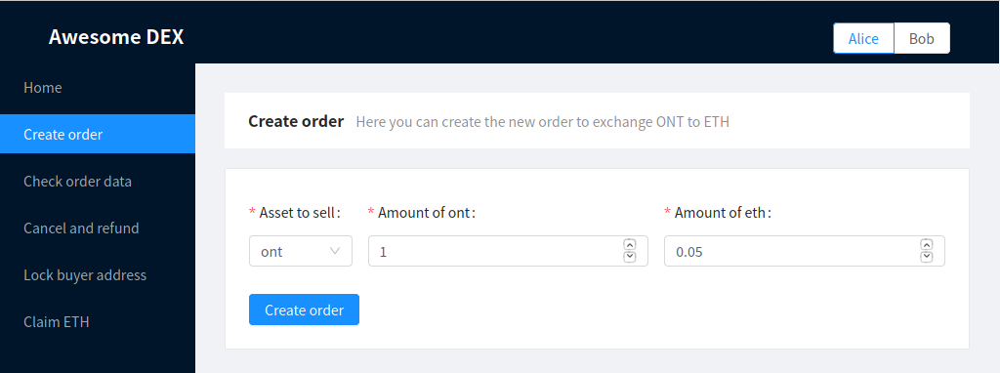

# awesome-dex

This is a demo prototype, that aims to showcase how Atomic Swaps can be used to build a DEX. 

The project consists of several parts:
* `/contracts/ontology` folder contains Ontology SC and unit tests for it
* `/contracts/ethereum` folder contains Ethereum SC
* `/frontend` folder contains simple frontend, that allows interacting with smart contracts mentioned above

## About the demo

#### Setting up

```
cd frontend
npm install
npm start
```
The demo can be accessed though `localhost:3000`

#### Notes

Frontend demo is not a fully-functional DEX, but rather a way to facilitate interaction with smart contracts in order to see, how atomic swaps work. 

Prototype interacts with Ontology SC 
(deployed to Ontology testnet on `14972f644a4c43a9e097ee55968f877ce799754d`)
and Ethereum SC (deployed to Ropsten testnet on `0x6ad25cb063bc6ebbc7a0ed66cbb91aa4c7fad86e`).

We've got 2 hardcoded users: Alice and Bob. Alice wants to sell some amount of ONT for ETH, and Bob wants to exchange his ETH to ONT.
Private keys and addresses are located on `frontend/src/api/constants` in `users` object.
Please, note, that you can use that users, but keep in mind, that they are not guaranteed to have sufficient balance of ETH and/or ONT.
You are welcome to recharge those wallets, but it would be best to replace hardcoded data with your own test accounts.

Demo provides *Check order data* page, that lets checking state of the order.
But it can also be handy to monitor what's going on with SC with testnet block explorers:

* *Ontology:* https://explorer.ont.io/contract/other/4d7599e77c878f9655ee97e0a9434c4a642f9714/10/1/testnet
* *Ethererum:* https://ropsten.etherscan.io/address/0x6ad25cb063bc6ebbc7a0ed66cbb91aa4c7fad86e

#### Workflow instruction

To initiate exchange switch to Alice and to go *Create order* page.



When transaction is completed, respective amount of ont will be transferred from Alice to smart contract.
The following message will appear:


It is important to save this values, otherwise access to those locked ONT will be permanently lost.

Let's assume that following data is safely stored by Alice:
```
Hashlock b9d2195fbd4b7a5812498d380b2275e4eb8b939920cc74288fa688f6e0849c93

Secret 97feb4ac885c56dd4bbb454fc1dbb0175e5fe5e66e123d394e83bd357a2d04cf569298d625cbc9799a5db2296e912448
```

Now it's time for Bob to respond to Alice's order. 
We assume that Bob knows hashlock and order details already (f.e. through using some public order book aggregator), but that is not significant in terms of our demo.

Let's switch to Bob and go to *Respond to order* page:


Here Bob inputs hashlock of the order he wants to respond to. 
Amount of ETH to be locked on Ethereum SC from Bob is automatically set from value in corresponding Ontology contract.

Now both Alice and Bob can persuade that order was initiated correctly:


Notice, how Ontology contract holds Alice's Ontology address (presented in hex) and Ethereum contract holds Bob's Ethereum address.

Say, someone changes his/her mind in any poin of time before locking addresses of other party.
In this case, refunding can take place.
Refund is also possible if other party's address was locked, but only after refund timelock.


Use refund from Alice's account to refund ONT and from Bob's account to refund ETH.
Refunding will only work if assets were not claimed by other party.

Now that Bob responded to Alice's order, she should lock buyer Ontology address.
It's a good idea to check order data first and verify, that appropriate amount of ETH was indeed locked.

After making sure that amount of ETH is sufficient, Alice goes to *Lock buyer address* page:


Notice, that Bob's Ontology address (hex representation) is inputted beforehand for convenience.

Now Bob should check order data and make that his Ontology address is correct.


After that Bob goes to *Lock initiator address page* and locks Alice Ethereum address (inputted beforehand as well).


Exchange is almost completed. At this point revealing secret and claiming assets should take place. 

Please note, that timelocks set in deployed testnet contracts are set to 10 seconds for purposes of quick proof of concept testing.
In real DEX timelocks should be 24h and 48h, instead of 10 and 20 seconds in Ethereum and Ontology contracts respectively.
It is also unsafe to perform claim after refund timelock time in a real exchange situation.


Alice now ensures, that her Ethereum address is correct:


She uses that address to send secret to Ethereum SC and claim her ETH from *Claim ETH* page:


The secret was revealed, Bob can get this value from *Check order data* page:


Bob copies the value of secret and inputs it on *Claim ONT* page:


That's it, exchange was performed successfully.

